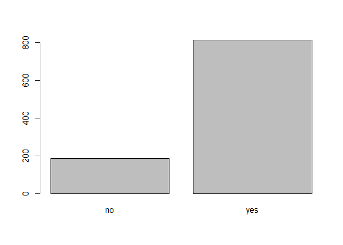
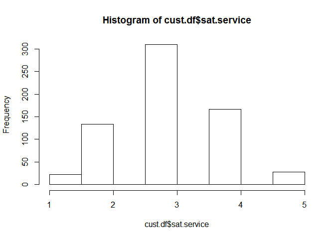
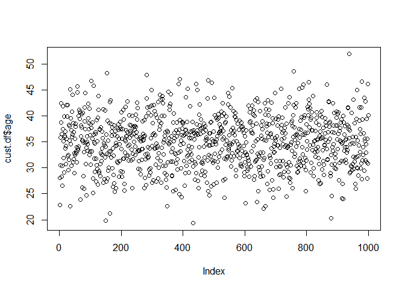
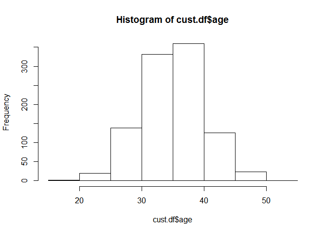
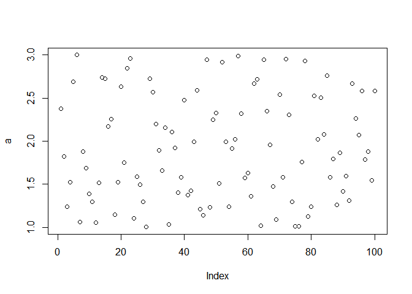
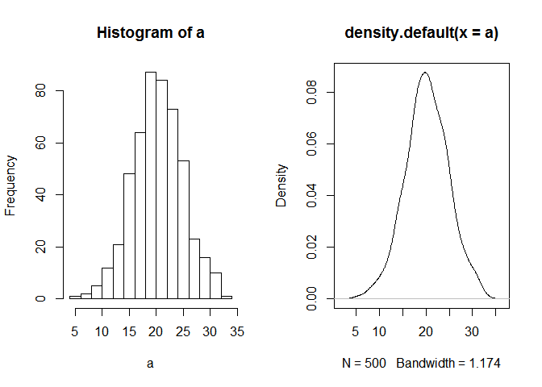
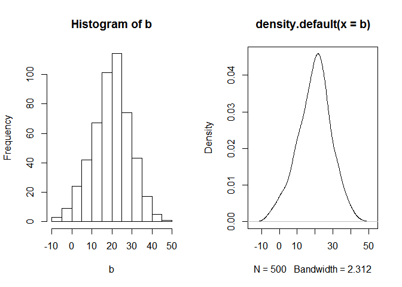
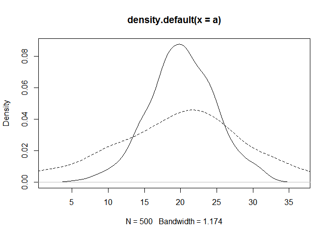

# 기술통계량 및 분포
김성근  
2017년 5월 22일  
# 기술통계량 확인
  - 데이터 로딩

```r
cust.df <- read.csv("http://goo.gl/PmPkaG")
str(cust.df)
```

```
## 'data.frame':	1000 obs. of  12 variables:
##  $ cust.id          : int  1 2 3 4 5 6 7 8 9 10 ...
##  $ age              : num  22.9 28 35.9 30.5 38.7 ...
##  $ credit.score     : num  631 749 733 830 734 ...
##  $ email            : Factor w/ 2 levels "no","yes": 2 2 2 2 1 2 2 2 1 1 ...
##  $ distance.to.store: num  2.58 48.18 1.29 5.25 25.04 ...
##  $ online.visits    : int  20 121 39 1 35 1 1 48 0 14 ...
##  $ online.trans     : int  3 39 14 0 11 1 1 13 0 6 ...
##  $ online.spend     : num  58.4 756.9 250.3 0 204.7 ...
##  $ store.trans      : int  4 0 0 2 0 0 2 4 0 3 ...
##  $ store.spend      : num  140.3 0 0 95.9 0 ...
##  $ sat.service      : int  3 3 NA 4 1 NA 3 2 4 3 ...
##  $ sat.selection    : int  3 3 NA 2 1 NA 3 3 2 2 ...
```

## 명목척도 

```r
length(cust.df$email)                                                 
```

```
## [1] 1000
```

```r
summary(cust.df$email)                        
```

```
##  no yes 
## 186 814
```

```r
table(cust.df$email) 
```

```
## 
##  no yes 
## 186 814
```

```r
barplot(table(cust.df$email))
```

<!-- -->

## 등간척도 

```r
summary(cust.df$sat.service) 
```

```
##    Min. 1st Qu.  Median    Mean 3rd Qu.    Max.    NA's 
##    1.00    3.00    3.00    3.07    4.00    5.00     341
```

```r
table(cust.df$sat.service) 
```

```
## 
##   1   2   3   4   5 
##  22 133 309 167  28
```

```r
hist(cust.df$sat.service)
```

<!-- -->

## 연속형(등간/비율척도) 척도
### 대표값 기술통계 

```r
mean(cust.df$age)
```

```
## [1] 34.92205
```

```r
var(cust.df$age)
```

```
## [1] 24.44905
```

```r
sd(cust.df$age)
```

```
## [1] 4.944598
```

```r
median(cust.df$age) 
```

```
## [1] 35.10423
```

```r
quantile(cust.df$age)
```

```
##       0%      25%      50%      75%     100% 
## 19.34134 31.42731 35.10423 38.20003 51.86274
```

```r
quantile(cust.df$age, 1/4)
```

```
##      25% 
## 31.42731
```

```r
quantile(cust.df$age, 3/4)
```

```
##      75% 
## 38.20003
```

```r
plot(cust.df$age)
```

<!-- -->

```r
hist(cust.df$age)
```

<!-- -->

### 단순 기술통계 

```r
min(cust.df$age)
```

```
## [1] 19.34134
```

```r
max(cust.df$age)
```

```
## [1] 51.86274
```

```r
range(cust.df$age) 
```

```
## [1] 19.34134 51.86274
```

## 분포의 대칭도 

```r
library(moments)
skewness(cust.df$age)  # 0보다 작으면 왼쪽 꼬리, 크면 오른쪽 꼬리   
```

```
## [1] -0.01855319
```

```r
kurtosis(cust.df$age)  # 3이 정규 분포   
```

```
## [1] 2.942959
```

## psycy 패키지를 활용한 기술통계량 확인

```r
library(psych)
describe(cust.df)
```

```
##                   vars    n   mean     sd median trimmed    mad    min
## cust.id              1 1000 500.50 288.82 500.50  500.50 370.65   1.00
## age                  2 1000  34.92   4.94  35.10   34.92   5.08  19.34
## credit.score         3 1000 725.49  50.25 725.46  725.43  48.27 542.97
## email*               4 1000   1.81   0.39   2.00    1.89   0.00   1.00
## distance.to.store    5 1000  14.66  22.94   7.13   10.06   7.23   0.21
## online.visits        6 1000  28.29  53.58   6.00   16.07   8.90   0.00
## online.trans         7 1000   8.38  16.00   2.00    4.72   2.97   0.00
## online.spend         8 1000 170.32 327.81  37.03   95.47  54.90   0.00
## store.trans          9 1000   1.32   1.61   1.00    1.04   1.48   0.00
## store.spend         10 1000  47.58  67.96  30.05   34.11  44.56   0.00
## sat.service         11  659   3.07   0.87   3.00    3.08   1.48   1.00
## sat.selection       12  659   2.40   0.89   2.00    2.37   1.48   1.00
##                       max   range  skew kurtosis    se
## cust.id           1000.00  999.00  0.00    -1.20  9.13
## age                 51.86   32.52 -0.02    -0.06  0.16
## credit.score       880.76  337.79 -0.07     0.13  1.59
## email*               2.00    1.00 -1.61     0.60  0.01
## distance.to.store  267.09  266.87  5.03    36.82  0.73
## online.visits      606.00  606.00  4.15    27.29  1.69
## online.trans       169.00  169.00  4.03    25.01  0.51
## online.spend      3593.03 3593.03  4.10    25.89 10.37
## store.trans         12.00   12.00  2.10     6.90  0.05
## store.spend        705.66  705.66  3.22    17.01  2.15
## sat.service          5.00    4.00 -0.05    -0.09  0.03
## sat.selection        5.00    4.00  0.18    -0.43  0.03
```

## 분포의 이해 ####
  - Bernoulli : 동전의 앞/뒤처럼 이벤트가 0 또는 1밖에 일어나지 않는 분포
  - Uniform : 주사위처럼 모든 결과에 대한 확률이 동일한 확률분포입니다.
  - Binomial : 0 또는 1이 나오는 이벤트(각각이 Bernoulli확률을 갖는 이벤트)에 대해 1이 발생활 횟수에 대한 확률입니다.
  - Gaussian : 우리가 알고 있는 정규분포
  - Log-normal : 변수의 log 값이 Gaussian을 나타내는 분포
  - Student’s t-distribution : 정규분포의 다른 형태(우리가 아는 t분포)
  - https://blog.cloudera.com/blog/2015/12/common-probability-distributions-the-data-scientists-crib-sheet/
  
### Bernoulli

```r
plot(cust.df$email)
```

<!-- -->

### Uniform

```r
a = runif(100, min=1, max=3) ; plot(a)
```

<!-- -->

### normal

```r
par(mfrow=c(1,2))
a = rnorm(500, 20, 5) ; hist(a)
plot(density(a))
```

<!-- -->

```r
b = rnorm(500, 20, 10) ; hist(b)
plot(density(b))
```

<!-- -->


### 두개분포 겹치기 

```r
plot(density(a))
lines(density(b), lty=2)
```

<!-- -->
