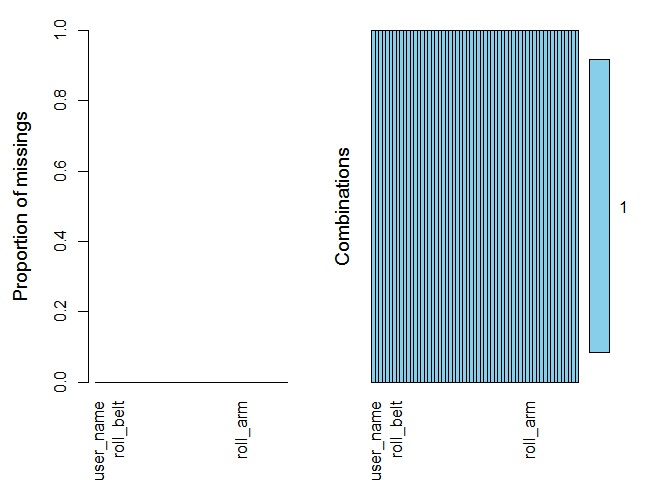

# NA_handle
김성근  
2017년 5월 22일  
# 결측값 다루기

## 데이터 로딩

```r
na_handle = read.csv("c:/data/pml-training.csv")
```

## NA 종류 파악하기 

```r
str(na_handle[,1:10])
```

```
## 'data.frame':	19622 obs. of  10 variables:
##  $ X                   : int  1 2 3 4 5 6 7 8 9 10 ...
##  $ user_name           : Factor w/ 6 levels "adelmo","carlitos",..: 2 2 2 2 2 2 2 2 2 2 ...
##  $ raw_timestamp_part_1: int  1323084231 1323084231 1323084231 1323084232 1323084232 1323084232 1323084232 1323084232 1323084232 1323084232 ...
##  $ raw_timestamp_part_2: int  788290 808298 820366 120339 196328 304277 368296 440390 484323 484434 ...
##  $ cvtd_timestamp      : Factor w/ 20 levels "02/12/2011 13:32",..: 9 9 9 9 9 9 9 9 9 9 ...
##  $ new_window          : Factor w/ 2 levels "no","yes": 1 1 1 1 1 1 1 1 1 1 ...
##  $ num_window          : int  11 11 11 12 12 12 12 12 12 12 ...
##  $ roll_belt           : num  1.41 1.41 1.42 1.48 1.48 1.45 1.42 1.42 1.43 1.45 ...
##  $ pitch_belt          : num  8.07 8.07 8.07 8.05 8.07 8.06 8.09 8.13 8.16 8.17 ...
##  $ yaw_belt            : num  -94.4 -94.4 -94.4 -94.4 -94.4 -94.4 -94.4 -94.4 -94.4 -94.4 ...
```

```r
str(na_handle[,20:30])
```

```
## 'data.frame':	19622 obs. of  11 variables:
##  $ max_yaw_belt        : Factor w/ 68 levels "","-0.1","-0.2",..: 1 1 1 1 1 1 1 1 1 1 ...
##  $ min_roll_belt       : num  NA NA NA NA NA NA NA NA NA NA ...
##  $ min_pitch_belt      : int  NA NA NA NA NA NA NA NA NA NA ...
##  $ min_yaw_belt        : Factor w/ 68 levels "","-0.1","-0.2",..: 1 1 1 1 1 1 1 1 1 1 ...
##  $ amplitude_roll_belt : num  NA NA NA NA NA NA NA NA NA NA ...
##  $ amplitude_pitch_belt: int  NA NA NA NA NA NA NA NA NA NA ...
##  $ amplitude_yaw_belt  : Factor w/ 4 levels "","#DIV/0!","0.00",..: 1 1 1 1 1 1 1 1 1 1 ...
##  $ var_total_accel_belt: num  NA NA NA NA NA NA NA NA NA NA ...
##  $ avg_roll_belt       : num  NA NA NA NA NA NA NA NA NA NA ...
##  $ stddev_roll_belt    : num  NA NA NA NA NA NA NA NA NA NA ...
##  $ var_roll_belt       : num  NA NA NA NA NA NA NA NA NA NA ...
```


## 결측정보 코딩 - "",NULL, NA, "#DIV/0!"

```r
na_handle = read.csv("c:/data/pml-training.csv", 
                     head = TRUE, 
                     na.strings = c(NA, "", "#DIV/0!", -999, NULL))
na_handle = na_handle[,-1]
```

## 결측현황 시각화

```r
library(Amelia)
```

```
## Warning: package 'Amelia' was built under R version 3.3.3
```

```
## Loading required package: Rcpp
```

```
## ## 
## ## Amelia II: Multiple Imputation
## ## (Version 1.7.4, built: 2015-12-05)
## ## Copyright (C) 2005-2017 James Honaker, Gary King and Matthew Blackwell
## ## Refer to http://gking.harvard.edu/amelia/ for more information
## ##
```

```r
missmap(na_handle)

library(VIM)
```

```
## Warning: package 'VIM' was built under R version 3.3.3
```

```
## Loading required package: colorspace
```

```
## Loading required package: grid
```

```
## Loading required package: data.table
```

```
## VIM is ready to use. 
##  Since version 4.0.0 the GUI is in its own package VIMGUI.
## 
##           Please use the package to use the new (and old) GUI.
```

```
## Suggestions and bug-reports can be submitted at: https://github.com/alexkowa/VIM/issues
```

```
## 
## Attaching package: 'VIM'
```

```
## The following object is masked from 'package:datasets':
## 
##     sleep
```

<!-- -->

```r
aggr_plot <- aggr(na_handle, 
                  numbers=TRUE, 
                  sortVars=TRUE,
                  labels=names(na_handle))
```

```
## Warning in plot.aggr(res, ...): not enough horizontal space to display
## frequencies
```

<!-- -->

```
## 
##  Variables sorted by number of missings: 
##                  Variable     Count
##         kurtosis_yaw_belt 1.0000000
##         skewness_yaw_belt 1.0000000
##     kurtosis_yaw_dumbbell 1.0000000
##     skewness_yaw_dumbbell 1.0000000
##      kurtosis_yaw_forearm 1.0000000
##      skewness_yaw_forearm 1.0000000
##    kurtosis_picth_forearm 0.9836408
##    skewness_pitch_forearm 0.9836408
##     kurtosis_roll_forearm 0.9835898
##           max_yaw_forearm 0.9835898
##           min_yaw_forearm 0.9835898
##     amplitude_yaw_forearm 0.9835898
##     skewness_roll_forearm 0.9835389
##        kurtosis_picth_arm 0.9833860
##        skewness_pitch_arm 0.9833860
##         kurtosis_roll_arm 0.9832841
##         skewness_roll_arm 0.9832331
##       kurtosis_picth_belt 0.9809398
##      skewness_roll_belt.1 0.9809398
##          kurtosis_yaw_arm 0.9798695
##          skewness_yaw_arm 0.9798695
##        kurtosis_roll_belt 0.9798186
##              max_yaw_belt 0.9798186
##              min_yaw_belt 0.9798186
##        amplitude_yaw_belt 0.9798186
##        skewness_roll_belt 0.9797676
##    kurtosis_roll_dumbbell 0.9795638
##          max_yaw_dumbbell 0.9795638
##          min_yaw_dumbbell 0.9795638
##    amplitude_yaw_dumbbell 0.9795638
##    skewness_roll_dumbbell 0.9795128
##   kurtosis_picth_dumbbell 0.9794109
##   skewness_pitch_dumbbell 0.9793599
##             max_roll_belt 0.9793089
##            max_picth_belt 0.9793089
##             min_roll_belt 0.9793089
##            min_pitch_belt 0.9793089
##       amplitude_roll_belt 0.9793089
##      amplitude_pitch_belt 0.9793089
##      var_total_accel_belt 0.9793089
##             avg_roll_belt 0.9793089
##          stddev_roll_belt 0.9793089
##             var_roll_belt 0.9793089
##            avg_pitch_belt 0.9793089
##         stddev_pitch_belt 0.9793089
##            var_pitch_belt 0.9793089
##              avg_yaw_belt 0.9793089
##           stddev_yaw_belt 0.9793089
##              var_yaw_belt 0.9793089
##             var_accel_arm 0.9793089
##              avg_roll_arm 0.9793089
##           stddev_roll_arm 0.9793089
##              var_roll_arm 0.9793089
##             avg_pitch_arm 0.9793089
##          stddev_pitch_arm 0.9793089
##             var_pitch_arm 0.9793089
##               avg_yaw_arm 0.9793089
##            stddev_yaw_arm 0.9793089
##               var_yaw_arm 0.9793089
##              max_roll_arm 0.9793089
##             max_picth_arm 0.9793089
##               max_yaw_arm 0.9793089
##              min_roll_arm 0.9793089
##             min_pitch_arm 0.9793089
##               min_yaw_arm 0.9793089
##        amplitude_roll_arm 0.9793089
##       amplitude_pitch_arm 0.9793089
##         amplitude_yaw_arm 0.9793089
##         max_roll_dumbbell 0.9793089
##        max_picth_dumbbell 0.9793089
##         min_roll_dumbbell 0.9793089
##        min_pitch_dumbbell 0.9793089
##   amplitude_roll_dumbbell 0.9793089
##  amplitude_pitch_dumbbell 0.9793089
##        var_accel_dumbbell 0.9793089
##         avg_roll_dumbbell 0.9793089
##      stddev_roll_dumbbell 0.9793089
##         var_roll_dumbbell 0.9793089
##        avg_pitch_dumbbell 0.9793089
##     stddev_pitch_dumbbell 0.9793089
##        var_pitch_dumbbell 0.9793089
##          avg_yaw_dumbbell 0.9793089
##       stddev_yaw_dumbbell 0.9793089
##          var_yaw_dumbbell 0.9793089
##          max_roll_forearm 0.9793089
##         max_picth_forearm 0.9793089
##          min_roll_forearm 0.9793089
##         min_pitch_forearm 0.9793089
##    amplitude_roll_forearm 0.9793089
##   amplitude_pitch_forearm 0.9793089
##         var_accel_forearm 0.9793089
##          avg_roll_forearm 0.9793089
##       stddev_roll_forearm 0.9793089
##          var_roll_forearm 0.9793089
##         avg_pitch_forearm 0.9793089
##      stddev_pitch_forearm 0.9793089
##         var_pitch_forearm 0.9793089
##           avg_yaw_forearm 0.9793089
##        stddev_yaw_forearm 0.9793089
##           var_yaw_forearm 0.9793089
##                 user_name 0.0000000
##      raw_timestamp_part_1 0.0000000
##      raw_timestamp_part_2 0.0000000
##            cvtd_timestamp 0.0000000
##                new_window 0.0000000
##                num_window 0.0000000
##                 roll_belt 0.0000000
##                pitch_belt 0.0000000
##                  yaw_belt 0.0000000
##          total_accel_belt 0.0000000
##              gyros_belt_x 0.0000000
##              gyros_belt_y 0.0000000
##              gyros_belt_z 0.0000000
##              accel_belt_x 0.0000000
##              accel_belt_y 0.0000000
##              accel_belt_z 0.0000000
##             magnet_belt_x 0.0000000
##             magnet_belt_y 0.0000000
##             magnet_belt_z 0.0000000
##                  roll_arm 0.0000000
##                 pitch_arm 0.0000000
##                   yaw_arm 0.0000000
##           total_accel_arm 0.0000000
##               gyros_arm_x 0.0000000
##               gyros_arm_y 0.0000000
##               gyros_arm_z 0.0000000
##               accel_arm_x 0.0000000
##               accel_arm_y 0.0000000
##               accel_arm_z 0.0000000
##              magnet_arm_x 0.0000000
##              magnet_arm_y 0.0000000
##              magnet_arm_z 0.0000000
##             roll_dumbbell 0.0000000
##            pitch_dumbbell 0.0000000
##              yaw_dumbbell 0.0000000
##      total_accel_dumbbell 0.0000000
##          gyros_dumbbell_x 0.0000000
##          gyros_dumbbell_y 0.0000000
##          gyros_dumbbell_z 0.0000000
##          accel_dumbbell_x 0.0000000
##          accel_dumbbell_y 0.0000000
##          accel_dumbbell_z 0.0000000
##         magnet_dumbbell_x 0.0000000
##         magnet_dumbbell_y 0.0000000
##         magnet_dumbbell_z 0.0000000
##              roll_forearm 0.0000000
##             pitch_forearm 0.0000000
##               yaw_forearm 0.0000000
##       total_accel_forearm 0.0000000
##           gyros_forearm_x 0.0000000
##           gyros_forearm_y 0.0000000
##           gyros_forearm_z 0.0000000
##           accel_forearm_x 0.0000000
##           accel_forearm_y 0.0000000
##           accel_forearm_z 0.0000000
##          magnet_forearm_x 0.0000000
##          magnet_forearm_y 0.0000000
##          magnet_forearm_z 0.0000000
##                    classe 0.0000000
```
## NA처리하기 

### 아예 완전히 삭제하고 시작하기 
  - NA합계가 0인 애들만 재할당

```r
colSums(is.na(na_handle))
```

```
##                user_name     raw_timestamp_part_1     raw_timestamp_part_2 
##                        0                        0                        0 
##           cvtd_timestamp               new_window               num_window 
##                        0                        0                        0 
##                roll_belt               pitch_belt                 yaw_belt 
##                        0                        0                        0 
##         total_accel_belt       kurtosis_roll_belt      kurtosis_picth_belt 
##                        0                    19226                    19248 
##        kurtosis_yaw_belt       skewness_roll_belt     skewness_roll_belt.1 
##                    19622                    19225                    19248 
##        skewness_yaw_belt            max_roll_belt           max_picth_belt 
##                    19622                    19216                    19216 
##             max_yaw_belt            min_roll_belt           min_pitch_belt 
##                    19226                    19216                    19216 
##             min_yaw_belt      amplitude_roll_belt     amplitude_pitch_belt 
##                    19226                    19216                    19216 
##       amplitude_yaw_belt     var_total_accel_belt            avg_roll_belt 
##                    19226                    19216                    19216 
##         stddev_roll_belt            var_roll_belt           avg_pitch_belt 
##                    19216                    19216                    19216 
##        stddev_pitch_belt           var_pitch_belt             avg_yaw_belt 
##                    19216                    19216                    19216 
##          stddev_yaw_belt             var_yaw_belt             gyros_belt_x 
##                    19216                    19216                        0 
##             gyros_belt_y             gyros_belt_z             accel_belt_x 
##                        0                        0                        0 
##             accel_belt_y             accel_belt_z            magnet_belt_x 
##                        0                        0                        0 
##            magnet_belt_y            magnet_belt_z                 roll_arm 
##                        0                        0                        0 
##                pitch_arm                  yaw_arm          total_accel_arm 
##                        0                        0                        0 
##            var_accel_arm             avg_roll_arm          stddev_roll_arm 
##                    19216                    19216                    19216 
##             var_roll_arm            avg_pitch_arm         stddev_pitch_arm 
##                    19216                    19216                    19216 
##            var_pitch_arm              avg_yaw_arm           stddev_yaw_arm 
##                    19216                    19216                    19216 
##              var_yaw_arm              gyros_arm_x              gyros_arm_y 
##                    19216                        0                        0 
##              gyros_arm_z              accel_arm_x              accel_arm_y 
##                        0                        0                        0 
##              accel_arm_z             magnet_arm_x             magnet_arm_y 
##                        0                        0                        0 
##             magnet_arm_z        kurtosis_roll_arm       kurtosis_picth_arm 
##                        0                    19294                    19296 
##         kurtosis_yaw_arm        skewness_roll_arm       skewness_pitch_arm 
##                    19227                    19293                    19296 
##         skewness_yaw_arm             max_roll_arm            max_picth_arm 
##                    19227                    19216                    19216 
##              max_yaw_arm             min_roll_arm            min_pitch_arm 
##                    19216                    19216                    19216 
##              min_yaw_arm       amplitude_roll_arm      amplitude_pitch_arm 
##                    19216                    19216                    19216 
##        amplitude_yaw_arm            roll_dumbbell           pitch_dumbbell 
##                    19216                        0                        0 
##             yaw_dumbbell   kurtosis_roll_dumbbell  kurtosis_picth_dumbbell 
##                        0                    19221                    19218 
##    kurtosis_yaw_dumbbell   skewness_roll_dumbbell  skewness_pitch_dumbbell 
##                    19622                    19220                    19217 
##    skewness_yaw_dumbbell        max_roll_dumbbell       max_picth_dumbbell 
##                    19622                    19216                    19216 
##         max_yaw_dumbbell        min_roll_dumbbell       min_pitch_dumbbell 
##                    19221                    19216                    19216 
##         min_yaw_dumbbell  amplitude_roll_dumbbell amplitude_pitch_dumbbell 
##                    19221                    19216                    19216 
##   amplitude_yaw_dumbbell     total_accel_dumbbell       var_accel_dumbbell 
##                    19221                        0                    19216 
##        avg_roll_dumbbell     stddev_roll_dumbbell        var_roll_dumbbell 
##                    19216                    19216                    19216 
##       avg_pitch_dumbbell    stddev_pitch_dumbbell       var_pitch_dumbbell 
##                    19216                    19216                    19216 
##         avg_yaw_dumbbell      stddev_yaw_dumbbell         var_yaw_dumbbell 
##                    19216                    19216                    19216 
##         gyros_dumbbell_x         gyros_dumbbell_y         gyros_dumbbell_z 
##                        0                        0                        0 
##         accel_dumbbell_x         accel_dumbbell_y         accel_dumbbell_z 
##                        0                        0                        0 
##        magnet_dumbbell_x        magnet_dumbbell_y        magnet_dumbbell_z 
##                        0                        0                        0 
##             roll_forearm            pitch_forearm              yaw_forearm 
##                        0                        0                        0 
##    kurtosis_roll_forearm   kurtosis_picth_forearm     kurtosis_yaw_forearm 
##                    19300                    19301                    19622 
##    skewness_roll_forearm   skewness_pitch_forearm     skewness_yaw_forearm 
##                    19299                    19301                    19622 
##         max_roll_forearm        max_picth_forearm          max_yaw_forearm 
##                    19216                    19216                    19300 
##         min_roll_forearm        min_pitch_forearm          min_yaw_forearm 
##                    19216                    19216                    19300 
##   amplitude_roll_forearm  amplitude_pitch_forearm    amplitude_yaw_forearm 
##                    19216                    19216                    19300 
##      total_accel_forearm        var_accel_forearm         avg_roll_forearm 
##                        0                    19216                    19216 
##      stddev_roll_forearm         var_roll_forearm        avg_pitch_forearm 
##                    19216                    19216                    19216 
##     stddev_pitch_forearm        var_pitch_forearm          avg_yaw_forearm 
##                    19216                    19216                    19216 
##       stddev_yaw_forearm          var_yaw_forearm          gyros_forearm_x 
##                    19216                    19216                        0 
##          gyros_forearm_y          gyros_forearm_z          accel_forearm_x 
##                        0                        0                        0 
##          accel_forearm_y          accel_forearm_z         magnet_forearm_x 
##                        0                        0                        0 
##         magnet_forearm_y         magnet_forearm_z                   classe 
##                        0                        0                        0
```

```r
na_zero = na_handle[,colSums(is.na(na_handle)) == 0]
```

  - 간단한 함수로도 가능

```r
na_zero2 = complete.cases(na_handle)
```

## NA가 일정 비율이상있는 경우 삭제하기
  - NA비율 산출하는 함수를 만들어 각 칼럼의 NA비율산출

```r
check_missing_value = function(x){sum(is.na(x))/length(x)*100}
c_name = apply(na_handle, 2, check_missing_value)
head(c_name, 20)
```

```
##            user_name raw_timestamp_part_1 raw_timestamp_part_2 
##              0.00000              0.00000              0.00000 
##       cvtd_timestamp           new_window           num_window 
##              0.00000              0.00000              0.00000 
##            roll_belt           pitch_belt             yaw_belt 
##              0.00000              0.00000              0.00000 
##     total_accel_belt   kurtosis_roll_belt  kurtosis_picth_belt 
##              0.00000             97.98186             98.09398 
##    kurtosis_yaw_belt   skewness_roll_belt skewness_roll_belt.1 
##            100.00000             97.97676             98.09398 
##    skewness_yaw_belt        max_roll_belt       max_picth_belt 
##            100.00000             97.93089             97.93089 
##         max_yaw_belt        min_roll_belt 
##             97.98186             97.93089
```
  - NA비율이 10%미만인 컬럼만 서브셋팅

```r
ten_below = na_handle[,c_name <= 10]
str(ten_below)
```

```
## 'data.frame':	19622 obs. of  59 variables:
##  $ user_name           : Factor w/ 6 levels "adelmo","carlitos",..: 2 2 2 2 2 2 2 2 2 2 ...
##  $ raw_timestamp_part_1: int  1323084231 1323084231 1323084231 1323084232 1323084232 1323084232 1323084232 1323084232 1323084232 1323084232 ...
##  $ raw_timestamp_part_2: int  788290 808298 820366 120339 196328 304277 368296 440390 484323 484434 ...
##  $ cvtd_timestamp      : Factor w/ 20 levels "02/12/2011 13:32",..: 9 9 9 9 9 9 9 9 9 9 ...
##  $ new_window          : Factor w/ 2 levels "no","yes": 1 1 1 1 1 1 1 1 1 1 ...
##  $ num_window          : int  11 11 11 12 12 12 12 12 12 12 ...
##  $ roll_belt           : num  1.41 1.41 1.42 1.48 1.48 1.45 1.42 1.42 1.43 1.45 ...
##  $ pitch_belt          : num  8.07 8.07 8.07 8.05 8.07 8.06 8.09 8.13 8.16 8.17 ...
##  $ yaw_belt            : num  -94.4 -94.4 -94.4 -94.4 -94.4 -94.4 -94.4 -94.4 -94.4 -94.4 ...
##  $ total_accel_belt    : int  3 3 3 3 3 3 3 3 3 3 ...
##  $ gyros_belt_x        : num  0 0.02 0 0.02 0.02 0.02 0.02 0.02 0.02 0.03 ...
##  $ gyros_belt_y        : num  0 0 0 0 0.02 0 0 0 0 0 ...
##  $ gyros_belt_z        : num  -0.02 -0.02 -0.02 -0.03 -0.02 -0.02 -0.02 -0.02 -0.02 0 ...
##  $ accel_belt_x        : int  -21 -22 -20 -22 -21 -21 -22 -22 -20 -21 ...
##  $ accel_belt_y        : int  4 4 5 3 2 4 3 4 2 4 ...
##  $ accel_belt_z        : int  22 22 23 21 24 21 21 21 24 22 ...
##  $ magnet_belt_x       : int  -3 -7 -2 -6 -6 0 -4 -2 1 -3 ...
##  $ magnet_belt_y       : int  599 608 600 604 600 603 599 603 602 609 ...
##  $ magnet_belt_z       : int  -313 -311 -305 -310 -302 -312 -311 -313 -312 -308 ...
##  $ roll_arm            : num  -128 -128 -128 -128 -128 -128 -128 -128 -128 -128 ...
##  $ pitch_arm           : num  22.5 22.5 22.5 22.1 22.1 22 21.9 21.8 21.7 21.6 ...
##  $ yaw_arm             : num  -161 -161 -161 -161 -161 -161 -161 -161 -161 -161 ...
##  $ total_accel_arm     : int  34 34 34 34 34 34 34 34 34 34 ...
##  $ gyros_arm_x         : num  0 0.02 0.02 0.02 0 0.02 0 0.02 0.02 0.02 ...
##  $ gyros_arm_y         : num  0 -0.02 -0.02 -0.03 -0.03 -0.03 -0.03 -0.02 -0.03 -0.03 ...
##  $ gyros_arm_z         : num  -0.02 -0.02 -0.02 0.02 0 0 0 0 -0.02 -0.02 ...
##  $ accel_arm_x         : int  -288 -290 -289 -289 -289 -289 -289 -289 -288 -288 ...
##  $ accel_arm_y         : int  109 110 110 111 111 111 111 111 109 110 ...
##  $ accel_arm_z         : int  -123 -125 -126 -123 -123 -122 -125 -124 -122 -124 ...
##  $ magnet_arm_x        : int  -368 -369 -368 -372 -374 -369 -373 -372 -369 -376 ...
##  $ magnet_arm_y        : int  337 337 344 344 337 342 336 338 341 334 ...
##  $ magnet_arm_z        : int  516 513 513 512 506 513 509 510 518 516 ...
##  $ roll_dumbbell       : num  13.1 13.1 12.9 13.4 13.4 ...
##  $ pitch_dumbbell      : num  -70.5 -70.6 -70.3 -70.4 -70.4 ...
##  $ yaw_dumbbell        : num  -84.9 -84.7 -85.1 -84.9 -84.9 ...
##  $ total_accel_dumbbell: int  37 37 37 37 37 37 37 37 37 37 ...
##  $ gyros_dumbbell_x    : num  0 0 0 0 0 0 0 0 0 0 ...
##  $ gyros_dumbbell_y    : num  -0.02 -0.02 -0.02 -0.02 -0.02 -0.02 -0.02 -0.02 -0.02 -0.02 ...
##  $ gyros_dumbbell_z    : num  0 0 0 -0.02 0 0 0 0 0 0 ...
##  $ accel_dumbbell_x    : int  -234 -233 -232 -232 -233 -234 -232 -234 -232 -235 ...
##  $ accel_dumbbell_y    : int  47 47 46 48 48 48 47 46 47 48 ...
##  $ accel_dumbbell_z    : int  -271 -269 -270 -269 -270 -269 -270 -272 -269 -270 ...
##  $ magnet_dumbbell_x   : int  -559 -555 -561 -552 -554 -558 -551 -555 -549 -558 ...
##  $ magnet_dumbbell_y   : int  293 296 298 303 292 294 295 300 292 291 ...
##  $ magnet_dumbbell_z   : num  -65 -64 -63 -60 -68 -66 -70 -74 -65 -69 ...
##  $ roll_forearm        : num  28.4 28.3 28.3 28.1 28 27.9 27.9 27.8 27.7 27.7 ...
##  $ pitch_forearm       : num  -63.9 -63.9 -63.9 -63.9 -63.9 -63.9 -63.9 -63.8 -63.8 -63.8 ...
##  $ yaw_forearm         : num  -153 -153 -152 -152 -152 -152 -152 -152 -152 -152 ...
##  $ total_accel_forearm : int  36 36 36 36 36 36 36 36 36 36 ...
##  $ gyros_forearm_x     : num  0.03 0.02 0.03 0.02 0.02 0.02 0.02 0.02 0.03 0.02 ...
##  $ gyros_forearm_y     : num  0 0 -0.02 -0.02 0 -0.02 0 -0.02 0 0 ...
##  $ gyros_forearm_z     : num  -0.02 -0.02 0 0 -0.02 -0.03 -0.02 0 -0.02 -0.02 ...
##  $ accel_forearm_x     : int  192 192 196 189 189 193 195 193 193 190 ...
##  $ accel_forearm_y     : int  203 203 204 206 206 203 205 205 204 205 ...
##  $ accel_forearm_z     : int  -215 -216 -213 -214 -214 -215 -215 -213 -214 -215 ...
##  $ magnet_forearm_x    : int  -17 -18 -18 -16 -17 -9 -18 -9 -16 -22 ...
##  $ magnet_forearm_y    : num  654 661 658 658 655 660 659 660 653 656 ...
##  $ magnet_forearm_z    : num  476 473 469 469 473 478 470 474 476 473 ...
##  $ classe              : Factor w/ 5 levels "A","B","C","D",..: 1 1 1 1 1 1 1 1 1 1 ...
```
  - 다시 NA현황 확인 

```r
aggr_plot <- aggr(ten_below, 
                  numbers=TRUE, 
                  sortVars=TRUE,
                  labels=names(na_handle))
```

<!-- -->

```
## 
##  Variables sorted by number of missings: 
##              Variable Count
##             user_name     0
##  raw_timestamp_part_1     0
##  raw_timestamp_part_2     0
##        cvtd_timestamp     0
##            new_window     0
##            num_window     0
##             roll_belt     0
##            pitch_belt     0
##              yaw_belt     0
##      total_accel_belt     0
##    kurtosis_roll_belt     0
##   kurtosis_picth_belt     0
##     kurtosis_yaw_belt     0
##    skewness_roll_belt     0
##  skewness_roll_belt.1     0
##     skewness_yaw_belt     0
##         max_roll_belt     0
##        max_picth_belt     0
##          max_yaw_belt     0
##         min_roll_belt     0
##        min_pitch_belt     0
##          min_yaw_belt     0
##   amplitude_roll_belt     0
##  amplitude_pitch_belt     0
##    amplitude_yaw_belt     0
##  var_total_accel_belt     0
##         avg_roll_belt     0
##      stddev_roll_belt     0
##         var_roll_belt     0
##        avg_pitch_belt     0
##     stddev_pitch_belt     0
##        var_pitch_belt     0
##          avg_yaw_belt     0
##       stddev_yaw_belt     0
##          var_yaw_belt     0
##          gyros_belt_x     0
##          gyros_belt_y     0
##          gyros_belt_z     0
##          accel_belt_x     0
##          accel_belt_y     0
##          accel_belt_z     0
##         magnet_belt_x     0
##         magnet_belt_y     0
##         magnet_belt_z     0
##              roll_arm     0
##             pitch_arm     0
##               yaw_arm     0
##       total_accel_arm     0
##         var_accel_arm     0
##          avg_roll_arm     0
##       stddev_roll_arm     0
##          var_roll_arm     0
##         avg_pitch_arm     0
##      stddev_pitch_arm     0
##         var_pitch_arm     0
##           avg_yaw_arm     0
##        stddev_yaw_arm     0
##           var_yaw_arm     0
##           gyros_arm_x     0
```

## NA채우기 
  - airquality데이터 NA값 생성하여 삽입

```r
air <- airquality
air[4:10,3] <- rep(NA,7)
air[1:5,4] <- NA
air <- air[-c(5,6)]
```

### mice패키지
  - 다양한 방식으로 NA의 대체값을 찾아 넣어줌
  - 채워넣기 전 현황

```r
library(mice)
```

```
## Warning: package 'mice' was built under R version 3.3.3
```

```r
aggr_plot <- aggr(air, col=c('navyblue','red'), 
                  numbers=TRUE, 
                  sortVars=TRUE, 
                  labels=names(data))
```

<!-- -->

```
## 
##  Variables sorted by number of missings: 
##  Variable      Count
##     Ozone 0.24183007
##   Solar.R 0.04575163
##      Wind 0.04575163
##      Temp 0.03267974
```

  - NA 대체함(디폴트는 추정된 평균으로 대체)

```r
impute_air = mice(air) #모든 인수 디폴트
```

```
## 
##  iter imp variable
##   1   1  Ozone  Solar.R  Wind  Temp
##   1   2  Ozone  Solar.R  Wind  Temp
##   1   3  Ozone  Solar.R  Wind  Temp
##   1   4  Ozone  Solar.R  Wind  Temp
##   1   5  Ozone  Solar.R  Wind  Temp
##   2   1  Ozone  Solar.R  Wind  Temp
##   2   2  Ozone  Solar.R  Wind  Temp
##   2   3  Ozone  Solar.R  Wind  Temp
##   2   4  Ozone  Solar.R  Wind  Temp
##   2   5  Ozone  Solar.R  Wind  Temp
##   3   1  Ozone  Solar.R  Wind  Temp
##   3   2  Ozone  Solar.R  Wind  Temp
##   3   3  Ozone  Solar.R  Wind  Temp
##   3   4  Ozone  Solar.R  Wind  Temp
##   3   5  Ozone  Solar.R  Wind  Temp
##   4   1  Ozone  Solar.R  Wind  Temp
##   4   2  Ozone  Solar.R  Wind  Temp
##   4   3  Ozone  Solar.R  Wind  Temp
##   4   4  Ozone  Solar.R  Wind  Temp
##   4   5  Ozone  Solar.R  Wind  Temp
##   5   1  Ozone  Solar.R  Wind  Temp
##   5   2  Ozone  Solar.R  Wind  Temp
##   5   3  Ozone  Solar.R  Wind  Temp
##   5   4  Ozone  Solar.R  Wind  Temp
##   5   5  Ozone  Solar.R  Wind  Temp
```

```r
completed_air = complete(impute_air,1)
```

  - 채워넣은 후

```r
aggr_plot = aggr(completed_air, col=c('navyblue','red'), 
                 numbers=TRUE, 
                 sortVars=TRUE, 
                 labels=names(data))
```

<!-- -->

```
## 
##  Variables sorted by number of missings: 
##  Variable Count
##     Ozone     0
##   Solar.R     0
##      Wind     0
##      Temp     0
```

#### Amelia패키지도 각종 머신러닝 기법을 활용해 NA를 대체해줌 각자 해볼것 
