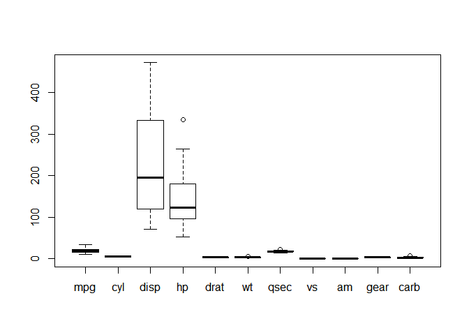

# 특이값 처리
김성근  
2017년 5월 22일  
# 특이값 처리 

## 박스플랏으로 특이값 확인 

```r
head(mtcars) #연속형 자료만 있음
```

```
##                    mpg cyl disp  hp drat    wt  qsec vs am gear carb
## Mazda RX4         21.0   6  160 110 3.90 2.620 16.46  0  1    4    4
## Mazda RX4 Wag     21.0   6  160 110 3.90 2.875 17.02  0  1    4    4
## Datsun 710        22.8   4  108  93 3.85 2.320 18.61  1  1    4    1
## Hornet 4 Drive    21.4   6  258 110 3.08 3.215 19.44  1  0    3    1
## Hornet Sportabout 18.7   8  360 175 3.15 3.440 17.02  0  0    3    2
## Valiant           18.1   6  225 105 2.76 3.460 20.22  1  0    3    1
```

```r
boxplot(mtcars)
```

<!-- -->

# 데이터 생성 

```r
cars1 <- cars[1:30, ]  
cars_outliers <- data.frame(speed=c(19,19,20,20,20), 
                            dist=c(190, 186, 210, 220, 218))  
cars2 <- rbind(cars1, cars_outliers)  
```

# 원본 및 이상치 추가한 데이터 비교 

```r
par(mfrow=c(1, 2))
#원본
plot(cars2$speed, cars2$dist, xlim=c(0, 28), 
     ylim=c(0, 230), 
     main="With Outliers", 
     xlab="speed", ylab="dist", 
     pch="*", col="red", cex=2)


abline(lm(dist ~ speed, data=cars2), 
       col="blue", lwd=3, lty=2)

#이상치 추가
plot(cars1$speed, cars1$dist, 
     xlim=c(0, 28), ylim=c(0, 230), 
     xlab="speed", ylab="dist", 
     pch="*", col="red", cex=2)

abline(lm(dist ~ speed, data=cars1), 
       col="blue", lwd=3, lty=2)
```

<!-- -->

## 한개변수의 이상치 추출

```r
boxplot.stats(cars2$dist)$out
```

```
## [1]  80 190 186 210 220 218
```

```r
boxplot(cars2$dist)
```

<!-- -->

## 여러변수의 이상치 추출

```r
library(psych)
outlier(iris[,1:3])
```

<!-- -->

```
##          1          2          3          4          5          6 
##  2.1271534  2.7692316  2.0701518  2.2608555  2.3648970  3.8834126 
##          7          8          9         10         11         12 
##  2.8619489  1.7085975  3.3629145  1.9698759  3.2109455  2.0572585 
##         13         14         15         16         17         18 
##  2.4889160  3.5984407  8.3237253  9.6285476  4.5485299  2.1271534 
##         19         20         21         22         23         24 
##  4.4926307  3.4039477  2.4165761  2.7207237  3.4873614  1.4265415 
##         25         26         27         28         29         30 
##  2.4985146  2.4197491  1.5864217  2.1335509  2.4829435  1.9436567 
##         31         32         33         34         35         36 
##  1.7396537  3.3014259  6.1617967  7.0003454  1.9698759  2.9149266 
##         37         38         39         40         41         42 
##  4.9446336  2.5541811  3.1548084  1.8330545  2.1795102  9.2653757 
##         43         44         45         46         47         48 
##  3.2654288  1.8622577  3.9006562  2.4889160  3.4553670  2.2815327 
##         49         50         51         52         53         54 
##  2.8650382  1.9269699  4.2524051  0.6268098  2.8025451  3.4712175 
##         55         56         57         58         59         60 
##  1.9631523  1.4392797  1.2001844  4.3073989  2.1301266  3.0208387 
##         61         62         63         64         65         66 
##  7.6829896  0.1899927  7.2695858  0.3871517  0.2547416  2.7577494 
##         67         68         69         70         71         72 
##  3.0345683  0.7030920  6.5271130  1.9068407  3.2284895  1.1629409 
##         73         74         75         76         77         78 
##  2.2157154  0.4559999  1.5794524  2.3046001  3.9749571  1.3774595 
##         79         80         81         82         83         84 
##  0.3076375  2.1094148  2.7560880  2.8910786  0.8577191  1.5122171 
##         85         86         87         88         89         90 
##  5.4412129  2.7625182  1.7799196  6.5333171  1.2935952  1.9856939 
##         91         92         93         94         95         96 
##  2.3860045  0.3375863  1.3407968  4.5366212  1.2063285  0.9848847 
##         97         98         99        100        101        102 
##  0.7499834  0.5042283  2.8310269  0.5622495  8.1741656  2.8402669 
##        103        104        105        106        107        108 
##  2.3722063  2.0259345  2.1797286  4.8181679 10.0924566  3.2763658 
##        109        110        111        112        113        114 
##  2.5507409  5.8349868  1.1348750  1.0221100  1.3374472  3.1069107 
##        115        116        117        118        119        120 
##  3.1635219  1.9638597  1.2349257  9.9443756  7.0795250  3.9526928 
##        121        122        123        124        125        126 
##  2.0192908  4.1491001  6.3211318  0.9346706  2.8857000  2.9597413 
##        127        128        129        130        131        132 
##  0.4909473  1.0062546  1.3456928  3.1653119  5.0971210 10.2087827 
##        133        134        135        136        137        138 
##  1.3456928  0.6687314  2.5894036  7.6251352  6.4217244  2.0776293 
##        139        140        141        142        143        144 
##  1.1928084  1.7667296  1.4657093  2.2427034  2.8402669  2.5280865 
##        145        146        147        148        149        150 
##  2.8857000  1.1292695  2.0387136  0.7266693  6.1178624  3.3097087
```
