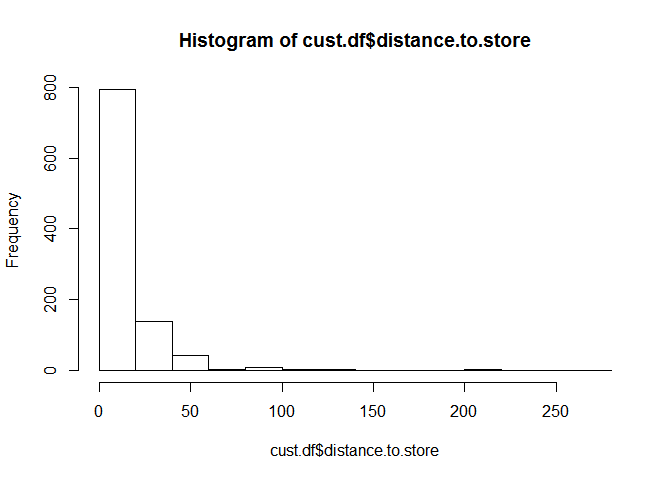
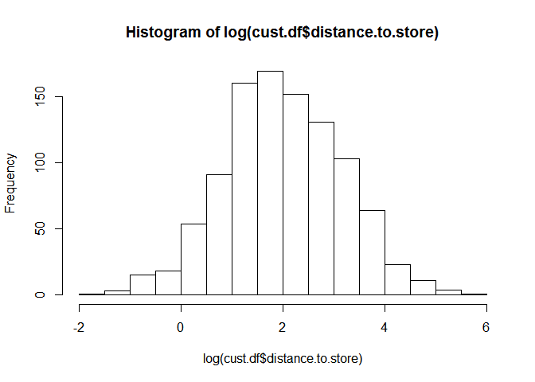

# 데이터변환
김성근  
2017년 5월 22일  

# 데이터변환 및 변수생성

## 데이터 생성

```r
dt = seq(as.Date("2000/1/1"), as.Date("2003/1/1"), by = "day")
num = rnorm(1097, 45 ,1)
day_transform = data.frame(dt,num)
day_transform = day_transform[-c(10:20),]
nrow(day_transform)
```

```
## [1] 1086
```

```r
head(day_transform)
```

```
##           dt      num
## 1 2000-01-01 45.34546
## 2 2000-01-02 44.21892
## 3 2000-01-03 45.03614
## 4 2000-01-04 44.81456
## 5 2000-01-05 45.55226
## 6 2000-01-06 46.58975
```

## 이산형 변수의 변환 (주중/주말 변수)

```r
day_transform$day = format(day_transform$dt,"%a")
day_transform[day_transform$day == "토", "day2"] = "주말"
day_transform[day_transform$day == "일", "day2"] = "주말"
day_transform[day_transform$day == "월", "day2"] = "평일"
day_transform[day_transform$day == "화", "day2"] = "평일"
day_transform[day_transform$day == "수", "day2"] = "평일"
day_transform[day_transform$day == "목", "day2"] = "평일"
day_transform[day_transform$day == "금", "day2"] = "평일"
head(day_transform)
```

```
##           dt      num day day2
## 1 2000-01-01 45.34546  토 주말
## 2 2000-01-02 44.21892  일 주말
## 3 2000-01-03 45.03614  월 평일
## 4 2000-01-04 44.81456  화 평일
## 5 2000-01-05 45.55226  수 평일
## 6 2000-01-06 46.58975  목 평일
```


## 연속형 변수의 변환 (로그변환) 

```r
cust.df <- read.csv("http://goo.gl/PmPkaG")
head(cust.df)
```

```
##   cust.id      age credit.score email distance.to.store online.visits
## 1       1 22.89437     630.6089   yes          2.582494            20
## 2       2 28.04994     748.5746   yes         48.175989           121
## 3       3 35.87942     732.5459   yes          1.285712            39
## 4       4 30.52740     829.5889   yes          5.253992             1
## 5       5 38.73575     733.7968    no         25.044693            35
## 6       6 42.41277     685.8721   yes         18.462041             1
##   online.trans online.spend store.trans store.spend sat.service
## 1            3     58.42999           4   140.32321           3
## 2           39    756.88008           0     0.00000           3
## 3           14    250.32801           0     0.00000          NA
## 4            0      0.00000           2    95.91194           4
## 5           11    204.69331           0     0.00000           1
## 6            1     19.01065           0     0.00000          NA
##   sat.selection
## 1             3
## 2             3
## 3            NA
## 4             2
## 5             1
## 6            NA
```

```r
# 수치변환
hist(cust.df$distance.to.store)
```

<!-- -->

```r
hist(log(cust.df$distance.to.store))
```

<!-- -->

```r
cust.df$log.dist = log(cust.df$distance.to.store)
```
